ldpercy.github.io
=================

Projects
--------

### Turtle

	

An implementation of [turtle graphics](https://en.wikipedia.org/wiki/Turtle_graphics) in JavaScript & SVG.

Live:
[ldpercy.github.io/turtle/](https://ldpercy.github.io/turtle/)

Github page:
[github.com/ldpercy/turtle/](https://github.com/ldpercy/turtle/)

### Year Clock

	
	

A clock-style 12 month calendar.

Live:
[ldpercy.github.io/year-clock/](https://ldpercy.github.io/year-clock/)

Github Page:
[github.com/ldpercy/year-clock](https://github.com/ldpercy/year-clock)

### Screensaver

	

Experiments with CSS and SVG animation.

Live:
[ldpercy.github.io/screensaver/](https://ldpercy.github.io/screensaver/)

Github page:
[github.com/ldpercy/screensaver/](https://github.com/ldpercy/screensaver/)

### Experiments - HTML, CSS, SVG, JS etc

https://ldpercy.github.io/html-experiment/

* [demo/polygon](https://ldpercy.github.io/html-experiment/demo/polygon/)
* [css/colour](https://ldpercy.github.io/html-experiment/css/colour.html)
* [css/colour-calc](https://ldpercy.github.io/html-experiment/css/colour-calc.html)
* [dom/transform](https://ldpercy.github.io/html-experiment/dom/transform2d.html)
* [dom/transform3d](https://ldpercy.github.io/html-experiment/dom/transform3d.html)
* [svg/text/baseline](https://ldpercy.github.io/html-experiment/svg/text/baseline.svg)

